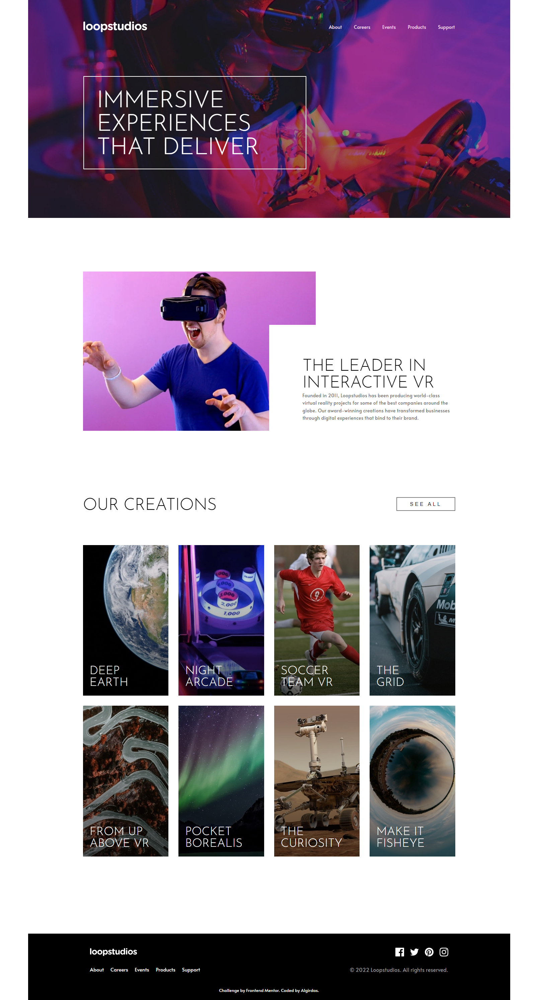

# Frontend Mentor - Loopstudios landing page solution

This is a solution to the [Loopstudios landing page challenge on Frontend Mentor](https://www.frontendmentor.io/challenges/loopstudios-landing-page-N88J5Onjw). Frontend Mentor challenges help you improve your coding skills by building realistic projects. 

## Table of contents

- [Overview](#overview)
  - [The challenge](#the-challenge)
  - [Screenshot](#screenshot)
  - [Links](#links)
- [My process](#my-process)
  - [Built with](#built-with)
  - [What I learned](#what-i-learned)
  - [Author](#author)
- [Acknowledgments](#acknowledgments)

## Overview

### The challenge

Users should be able to:

- View the optimal layout for the site depending on their device's screen size
- See hover states for all interactive elements on the page

### Screenshot

### Lighthouse

### Links

- Solution URL: (https://github.com/AlgirdasU/Loopstudio-landing-page)
- Live Site URL: (https://preeminent-wisp-7cafd0.netlify.app)

## My process

### Built with

- Semantic HTML5 markup
- BEM
- CSS custom properties
- SCSS
- Flexbox
- CSS Grid
- @mixin

### What I learned

In this project I focused on the css grid, which is a gear when I should manipulate a lot of elements of course in certain situation CSS grid helps create a responsive design.
If necessary with CSS Grid  it is enough to specify the location by using grid-row and grid-column properties of an element without thinking about html.
To see how you can add code snippets, see below:

## Author

- Website - [Algirdas Urbonavicius](https://github.com/AlgirdasU/Loopstudio-landing-page)
- Frontend Mentor - [@AlgirdasU](https://www.frontendmentor.io/profile/AlgirdasU)
- Twitter - [@AlgirdasDdd](https://twitter.com/algirdasddd)
